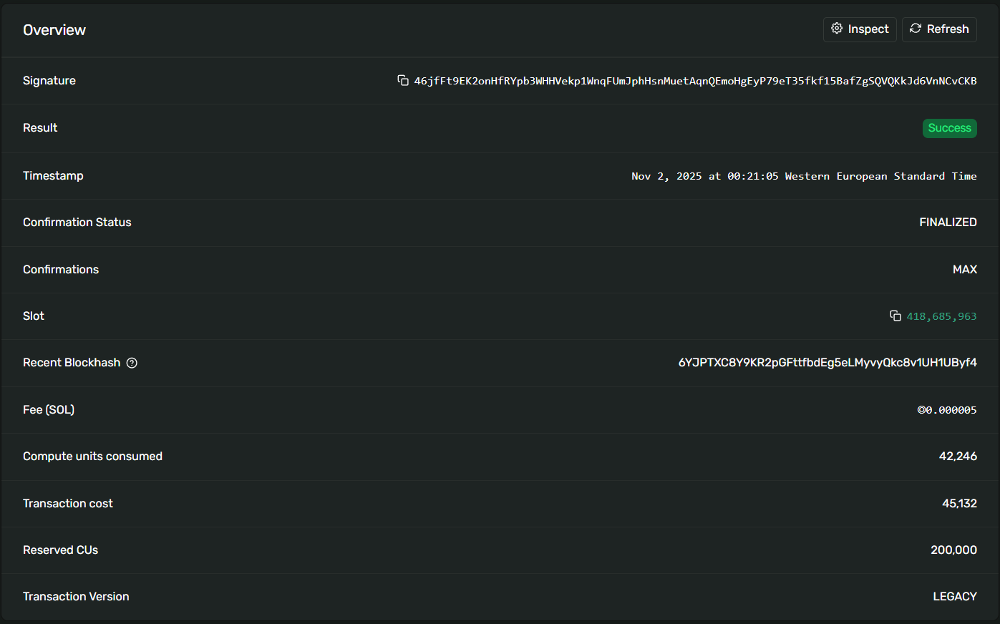
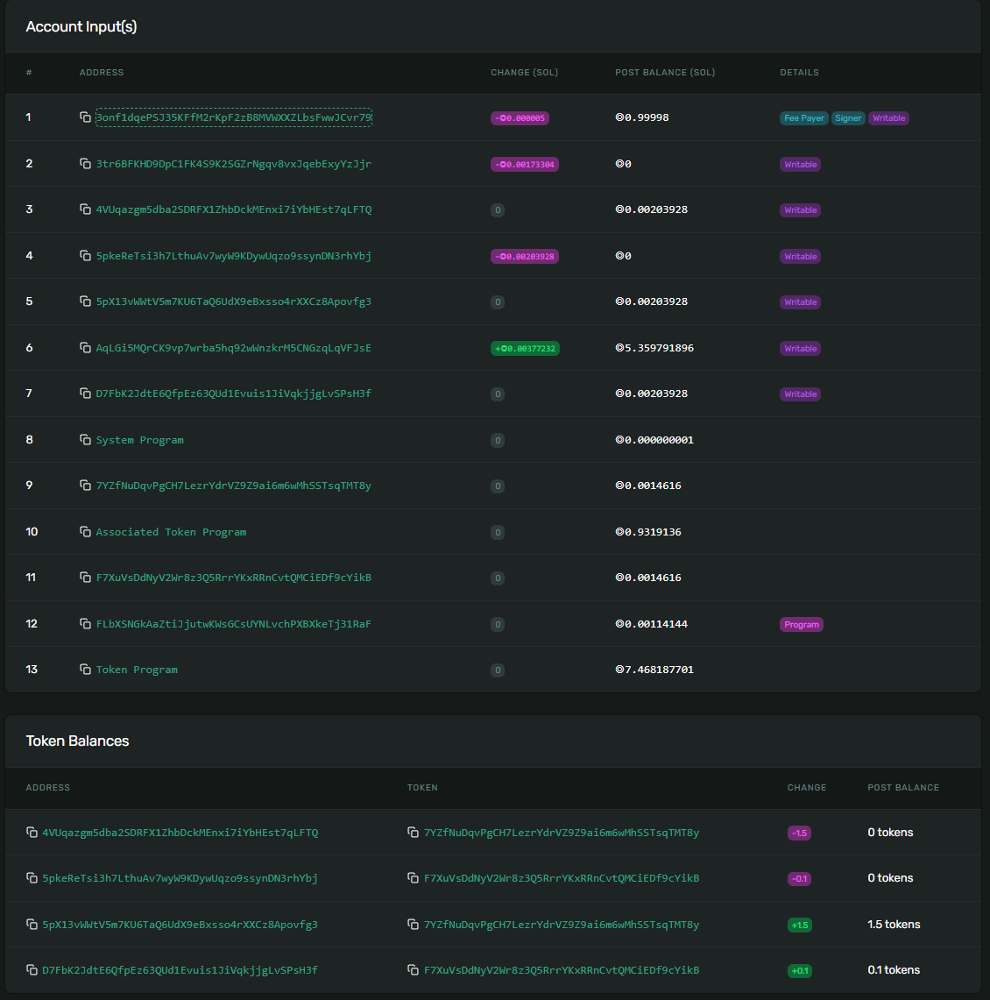

# Safe Harbor

A Solana escrow program built with Anchor that enables secure token exchanges between makers and takers. Makers can create escrow offers, deposit tokens, and takers can complete the exchange or makers can refund their deposits.

## Features

- **Make**: Create an escrow offer and deposit tokens into a vault
- **Take**: Accept an escrow offer by depositing required tokens and receiving vault tokens
- **Refund**: Cancel an escrow offer and recover deposited tokens and rent

## Live Demo (Devnet)

### Escrow Account

<div style="display: flex; gap: 20px;">
  
  
</div>

**Transaction completing the escrow (Take):**

[46jfFt9EK2onHfRYpb3WHHVekp1WnqFUmJphHsnMuetAqnQEmoHgEyP79eT35fkf15BafZgSQVQKkJd6VnNCvCKB](https://explorer.solana.com/tx/46jfFt9EK2onHfRYpb3WHHVekp1WnqFUmJphHsnMuetAqnQEmoHgEyP79eT35fkf15BafZgSQVQKkJd6VnNCvCKB?cluster=devnet)

### Program ID

[FLbXSNGkAaZtiJjutwKWsGCsUYNLvchPXBXkeTj31RaF](https://explorer.solana.com/address/FLbXSNGkAaZtiJjutwKWsGCsUYNLvchPXBXkeTj31RaF?cluster=devnet)

### Example Transactions

**Initialize Escrow Transaction:**

[5WvZfKsXk6tnT4WZZPvPao3i5ZF3JxeC99py3gWWBC8J681dfgc3cedBqEQsbQaHD3zzZmb1iBjPaY5EmapbPzDT](https://explorer.solana.com/tx/5WvZfKsXk6tnT4WZZPvPao3i5ZF3JxeC99py3gWWBC8J681dfgc3cedBqEQsbQaHD3zzZmb1iBjPaY5EmapbPzDT?cluster=devnet)

**Complete Escrow Transaction (Take):**

[46jfFt9EK2onHfRYpb3WHHVekp1WnqFUmJphHsnMuetAqnQEmoHgEyP79eT35fkf15BafZgSQVQKkJd6VnNCvCKB](https://explorer.solana.com/tx/46jfFt9EK2onHfRYpb3WHHVekp1WnqFUmJphHsnMuetAqnQEmoHgEyP79eT35fkf15BafZgSQVQKkJd6VnNCvCKB?cluster=devnet)

**Refund Transaction:**

[21kHomx5NgyNTBigzrioD7Aj4bQcjwY6TVPvNSh1v5Wxf8FS66EnJBwnjBoMXHjqcE2gDnxBCJFkQNg7C9BA9zx2](https://explorer.solana.com/tx/21kHomx5NgyNTBigzrioD7Aj4bQcjwY6TVPvNSh1v5Wxf8FS66EnJBwnjBoMXHjqcE2gDnxBCJFkQNg7C9BA9zx2?cluster=devnet)

## Instructions

### Make

Creates a new escrow PDA, initializes the escrow state, and deposits tokens from the maker into the vault.

**Parameters:**
- `seed`: Unique identifier for the escrow
- `receive`: Amount of tokens (mint_b) the maker wants to receive
- `deposit`: Amount of tokens (mint_a) the maker deposits

```rust
pub fn make(ctx: Context<Make>, seed: u64, receive: u64, deposit: u64) -> Result<()>
```

**What it does:**
- Creates escrow PDA account with maker, mints, and receive amount
- Transfers deposit amount from maker to vault
- Vault is owned by escrow PDA

### Take

Allows a taker to complete the escrow by depositing the required tokens to the maker and receiving the vault tokens.

```rust
pub fn take(ctx: Context<Take>) -> Result<()>
```

**What it does:**
- Transfers `receive` amount from taker to maker (mint_b)
- Transfers all tokens from vault to taker (mint_a)
- Closes vault account and returns rent to maker
- Closes escrow account and returns rent to maker

### Refund

Allows the maker to cancel an unaccepted escrow and recover their deposited tokens.

```rust
pub fn refund(ctx: Context<Refund>) -> Result<()>
```

**What it does:**
- Transfers all tokens from vault back to maker
- Closes vault account and returns rent to maker
- Closes escrow account and returns rent to maker

## Account Structure

### Escrow Account

The escrow PDA stores:
- `seed`: Unique seed for the escrow
- `maker`: Public key of the escrow creator
- `mint_a`: Token mint deposited by maker
- `mint_b`: Token mint required from taker
- `receive`: Amount of mint_b tokens maker wants to receive
- `bump`: PDA bump seed

### Vault Account

A token account (ATA) owned by the escrow PDA that holds the maker's deposited tokens (mint_a).

## Setup

### Prerequisites

- [Anchor](https://www.anchor-lang.com/) installed
- [Solana CLI](https://docs.solana.com/cli/install-solana-cli-tools) installed
- Node.js and npm/yarn

### Installation

```bash
# Install dependencies
npm install
# or
yarn install

# Build the program
anchor build

# Run tests
anchor test
```

## Testing

The test suite covers:

- Escrow initialization and token deposit
- Validating escrow state
- Token balance verification
- Completing escrow (take instruction)
- Token transfers between maker and taker
- Account closure and rent recovery
- Refunding escrow and recovering tokens

Run tests with:

```bash
anchor test
```

## Security Features

- PDA-based escrow accounts prevent unauthorized access
- Atomic token transfers ensure exchange completion or rollback
- Rent-exempt account creation and proper rent recovery
- Account validation ensures only valid escrows can be taken or refunded
